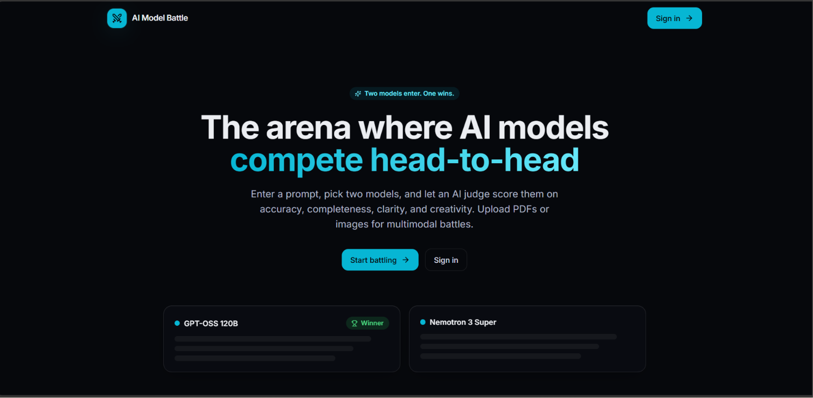
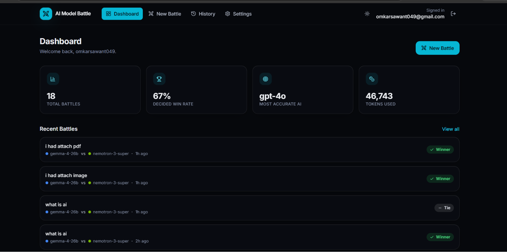
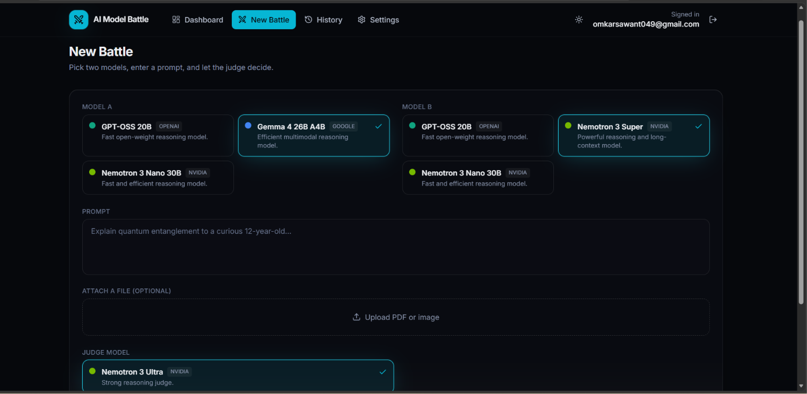
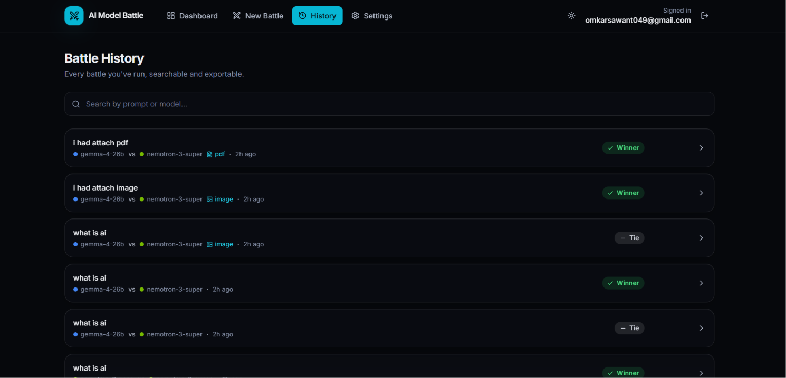

# ⚔️ AI Model Battle

A full-stack MERN application where two AI models compete on the same prompt and an AI judge decides the winner based on accuracy, completeness, clarity, and creativity.

---

# 🌐 Live Demo

**Frontend**

https://aimodel-battle-backend.vercel.app

**Backend**

https://aimodel-battle-backend.onrender.com

---

# 📸 Preview

### 🏠 Home



### 📊 Dashboard



### ⚔️ AI Battle



### 📜 Battle History



---

# ✨ Features

## ⚔️ AI Model Battle

- Select two different AI models
- Send the same prompt to both models
- Generate responses side-by-side
- Compare model responses
- Track response latency
- Track token usage
- Automatically determine the winner

---

## ⚖️ AI Judge

- Third AI model evaluates both responses
- Accuracy scoring
- Completeness scoring
- Clarity scoring
- Creativity scoring
- Scores each criterion from 0–10
- Declares Model A, Model B, or Tie
- Provides an explanation for the final verdict

---

## 🤖 Multiple AI Models

- GPT-OSS 120B
- GPT-OSS 20B
- NVIDIA Nemotron
- Google Gemma
- Models accessed through OpenRouter
- Easy to add additional models

---

## 📄 File Analysis

- Upload PDF files
- Upload images
- Extract text from PDFs


---

## 📊 Dashboard

- Total battles
- Overall win rate
- Most accurate AI model
- Total tokens used
- Recent battles
- Battle statistics

---

## 📜 Battle History

- Save every completed battle
- Search battle history
- View previous battles
- Delete individual battles
- Export battle results as TXT

---

## 👤 Authentication

- User Signup
- User Login
- Protected routes
- Profile management
- Change password
- Secure logout

---

## 🎨 UI & Experience

- Modern AI battle interface
- Dark / Light mode
- Responsive design
- Framer Motion animations
- Loading states
- Animated score bars
- Winner / Loser badges
- Copy response functionality
- Toast notifications
- Mobile responsive layout

---

# 🚀 Tech Stack

## Frontend

- React
- JavaScript
- Vite
- Tailwind CSS
- Framer Motion
- React Router
- Axios
- Lucide React
- Sonner

## Backend

- Node.js
- Express.js
- MongoDB
- Mongoose
- JWT
- bcryptjs
- Multer

## AI

- OpenRouter
- OpenAI-compatible SDK
- GPT-OSS
- NVIDIA Nemotron
- Google Gemma

## Deployment

- Vercel — Frontend
- Render — Backend
- MongoDB Atlas — Database

---

# 📂 Project Structure

```text
AI-Model-Battle
│
├── backend
│   ├── config
│   ├── controllers
│   ├── middleware
│   ├── models
│   ├── routes
│   ├── services
│   ├── utils
│   ├── uploads
│   └── server.js
│
├── frontend
│   ├── public
│   ├── src
│   │   ├── components
│   │   ├── context
│   │   ├── layouts
│   │   ├── pages
│   │   ├── services
│   │   ├── styles
│   │   └── utils
│   └── vite.config.js
│
├── .gitignore
└── README.md
```
---
# 🛠️ Installation

Clone the repository

```bash
git clone https://github.com/omkar2004sawant/AI-Model-Battle.git
cd AI-Model-Battle
```

Install Backend

```bash
cd backend
npm install
```

Create `backend/.env`

```env
PORT=3000
MONGO_URI=YOUR_MONGODB_URI
JWT_SECRET=YOUR_JWT_SECRET
OPENROUTER_API_KEY=YOUR_OPENROUTER_API_KEY
CLIENT_URL=http://localhost:5173
```

Install Frontend

```bash
cd ../frontend
npm install
```

Create `frontend/.env`

```env
VITE_API_URL=http://localhost:3000/api
```

---

# ▶️ Run Locally

### Backend

```bash
cd backend
npm run dev
```

### Frontend

```bash
cd frontend
npm run dev
```

---

# 🌍 Deployment

### Frontend

**Vercel**

https://aimodel-battle-backend.vercel.app

### Backend

**Render**

https://aimodel-battle-backend.onrender.com

---

# 🎯 Highlights

- ⚔️ Head-to-Head AI Model Comparison
- ⚖️ AI-Powered Judging System
- 🤖 Multiple AI Models
- 📊 Battle Analytics
- 📜 Persistent Battle History
- 📄 PDF & Image Analysis
- 🌙 Dark / Light Mode
- ⚡ REST API Architecture
- 🗄️ MongoDB Database
- 🚀 Full Stack MERN Application

---

# 👨‍💻 Author

### Omkar Sawant

**GitHub**

https://github.com/omkar2004sawant

**LinkedIn**

https://linkedin.com/in/osomkarsawant

---

⭐ **If you like this project, don't forget to star the repository!**